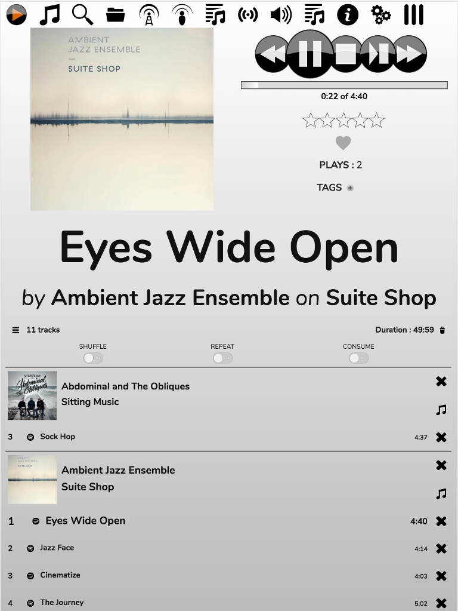
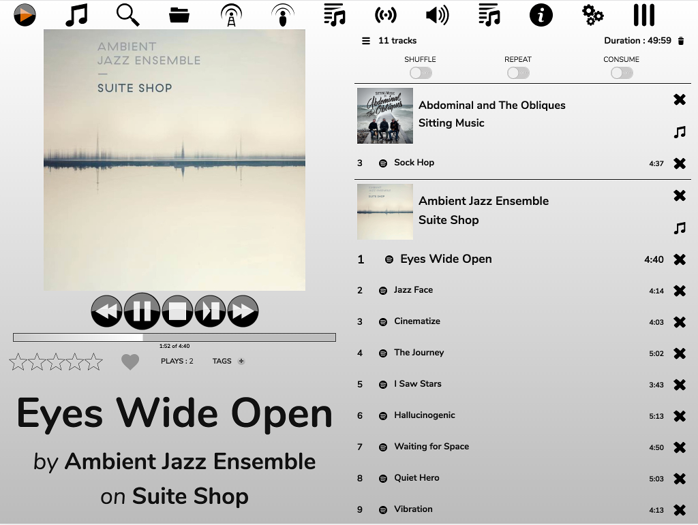
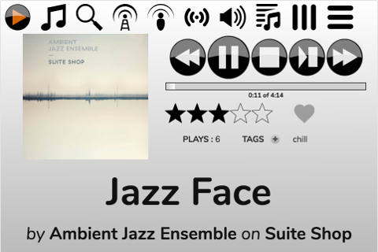

# The Tablet Skin

The Tablet Skin is the default if you're accessing RompЯ on a small screen that isn't as small as a phone screen. It lays things out in a different way but is functionally identical to the Desktop skin except that drag-and-drop is not supported, and nor is the Album Art manager.
 
The tablet skin adjusts its layout according to the size and orientation of your screen.

For example here is how it looks on an iPad in portrait mode.

Across the top are the icons to select different Music Sources, the Info Panel, Configuration Menu, and the dropdown menu of plugins like the Ratings and Tags Manager, Playlist Manager, etc.

Below that is the Now Playing area and below that is the Current Playlist.

Here's how it looks if you rotate to landscape mode.

In this mode the Now Playing panel will always be visible unless you open the Info panel. All the other panels use the right-hand side of the screen.

On smaller screens things can look a little different. Here's an iPhone 6

The Current Playlist now doesn't display on the same screen as the Now Playing panel, and some of the top icons have been shifted into a drop-down menu on the far right.

If you have a really small screen, you won't get two columns in landscape mode:

The default action on the Tablet skin is to single-click to add items to the Current Playlist, though this can be changed from the Configuration menu. Everything else works the same as the Desktop skin.
